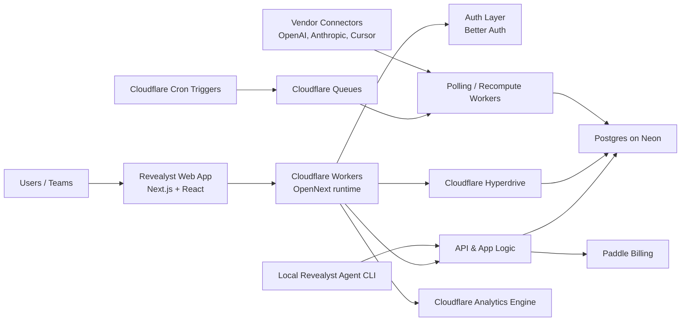

# Revealyst - Architecture Brief

**Basis:** the shipped code on `main`, [docs/Revealyst_Product_Spec_V3.md](Revealyst_Product_Spec_V3.md), and the live infrastructure notes in [docs/infra.md](infra.md).  
**Production runtime:** Cloudflare Workers at `https://revealyst.thapi.workers.dev` with the app/auth split documented in [docs/infra.md](infra.md).  
**Scope of this brief:** the deployed V1 platform shape - web app, data plane, background jobs, billing, and the currently wired connectors.

Revealyst is a multi-tenant AI-adoption analytics platform built as a single TypeScript monolith. The product surface is a Next.js web app; the runtime is Cloudflare Workers via OpenNext; the system of record is Postgres on Neon, reached from Workers through Hyperdrive. Scheduled polling, nightly recompute, and billing metering run on Cloudflare Cron Triggers and Queues rather than on a separate worker fleet.

The design choice throughout V1 is operational simplicity with hard tenancy boundaries: one database, `org_id` on every row, request-scoped DB/auth clients, and async ingestion decoupled from user-facing requests. Personal mode and Team mode run on the same machinery; "personal" is an org of one, not a separate stack.

## Technology Stack

| Layer | Technology | Role in the platform |
|---|---|---|
| Web application | **Next.js 16**, **React 19**, **TypeScript** | Main product UI and application framework |
| Hosting / runtime | **Cloudflare Workers** via **OpenNext** | Runs the app and API at the edge |
| Database | **Postgres** on **Neon** | Primary transactional data store |
| DB connectivity | **Cloudflare Hyperdrive** | Managed, optimized connection path from Workers to Postgres |
| ORM / migrations | **Drizzle ORM** + **drizzle-kit** | Typed database access and schema migrations |
| Authentication | **Better Auth** | User auth, sessions, email/password login, optional GitHub OAuth |
| Background processing | **Cloudflare Cron Triggers** + **Cloudflare Queues** | Scheduled polling, nightly recompute, async processing |
| Billing | **Paddle** | Subscription checkout, customer portal, seat-based metering |
| Analytics events | **Cloudflare Analytics Engine** | Product and launch event tracking |
| UI system | **Tailwind CSS v4**, **shadcn/ui**, **Base UI**, **Lucide** | Design system, UI primitives, icons |
| Validation / contracts | **Zod** | Runtime validation and typed contracts |
| Automated testing | **Vitest** | Unit and integration test coverage |
| Local ingestion agent | **Revealyst Agent CLI** | Local log summarization and metric push workflow |
| Supported integrations | **OpenAI**, **Anthropic Console**, **Cursor** | Current vendor data connectors |

## High-Level Architecture

## Runtime Flow

1. Users load the Next.js application, served from the Cloudflare Workers runtime.
2. Authenticated app routes and JSON APIs execute in the same Worker runtime, with session handling through Better Auth.
3. Application reads and writes go to Postgres on Neon through Hyperdrive, using Drizzle ORM as the typed query layer.
4. Connector polling does not run inline with page requests. Cron Triggers enqueue work; Queue consumers poll vendors, normalize payloads, and persist `metric_records`.
5. Nightly score recompute uses the same queue path: one message per org, recomputing derived score rows from persisted facts.
6. Billing uses Paddle for checkout and portal flows, with seat metering reported from tracked-user counts on a scheduled queue job.
7. Launch and product-view events that are not derivable from database rows are written to Cloudflare Analytics Engine.
8. A separate local CLI, `revealyst-agent`, summarizes Claude Code session logs locally and pushes metric records into the same API surface.

## Deployed Characteristics

- **Single deployable application:** app UI, APIs, queue handlers, and scheduled handlers live in one TypeScript codebase.
- **Edge runtime with managed data plane:** Cloudflare Workers handles request execution; Neon + Hyperdrive handles the Postgres side.
- **Async ingestion by default:** vendor polling, backfill, recompute, and metering are queue-driven, not request-driven.
- **Tenant isolation is foundational:** the application model is org-scoped throughout; personal mode reuses the same org-scoped path.
- **Connector-based ingestion:** vendor-specific collection logic is isolated behind normalized connector modules; the currently wired set is OpenAI, Anthropic Console, and Cursor.
- **Lean service surface:** there is no separate microservice fleet, Kafka layer, or second analytics database in V1.

## Notes For External Readers

This architecture is optimized for a self-serve SaaS product that needs to ingest vendor telemetry on a schedule, preserve org boundaries, and stay operationally light. It is not a batch-data warehouse architecture and does not depend on a separate stream-processing stack. The current design keeps the platform small enough to operate simply while still supporting scheduled ingestion, score recomputation, subscription billing, and a growing connector surface.
