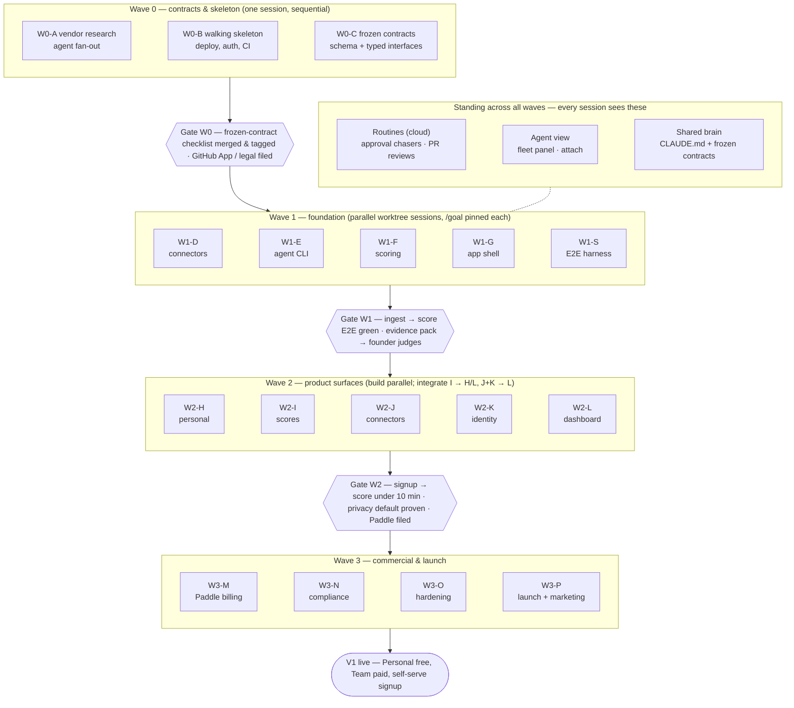
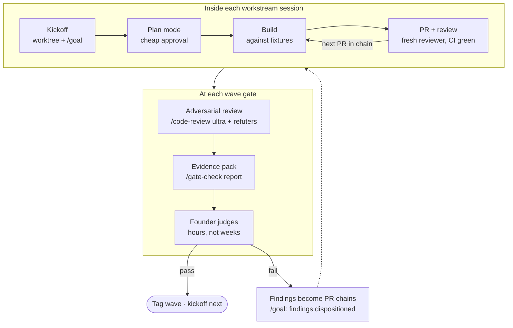

# Revealyst — Claude Code Execution Workflow

**Version:** 1.4 · **Date:** July 4, 2026 · *(1.1: goals, agent view/background sessions, loops, routines, saved workflows, agent-teams pilot — verified against current Claude Code docs · 1.2: pipeline + gate-protocol diagrams · 1.3: §7 small-team scaling · 1.4: §8 simplified review & testing default)*
**Basis:** [Revealyst V1 Execution Plan v2.1](Revealyst_Execution_Plan.md)
**Runtime decision:** **Local-first.** The agent fleet runs as Claude Code sessions on the founder's machine — one git worktree + one session per lettered workstream, the Workflow tool for intra-session fan-out, cloud only where a specific feature is cloud-native (`/code-review ultra`, routines). Nothing here requires CI-hosted or cloud-hosted agents; they can be added later without changing the model.

This document translates the execution plan's orchestration rules into concrete Claude Code mechanics: which feature or plugin implements each rule, what to set up before W0 exits, and how each wave is actually run.

---

## 1. Operating model — plan concept → Claude Code primitive

| Execution-plan concept | Claude Code primitive |
|---|---|
| One agent, one workstream, one PR chain (rule 3) | One **git worktree** + one dedicated Claude Code session per lettered workstream; the session lives as long as the workstream |
| Wave fan-out ("everything inside a wave runs concurrently") | Parallel worktree sessions (terminal tabs) for the big workstreams; the **Workflow tool** for fan-out *inside* a session where sub-tasks share one contract (e.g., three W2-J connectors) |
| Contracts before fan-out (rule 1) | Typed interfaces in-repo + a **frozen-contracts section in `CLAUDE.md`** (loaded into every session automatically) + CI contract tests + git tag at freeze |
| Fixtures over coupling (rule 2) | Fixture directories are part of the frozen contract; each workstream session is told in its kickoff prompt to build against fixtures and *never* read another workstream's branch |
| Adversarial pre-review at gates (rule 4) | **`/code-review ultra`** — multi-agent cloud review of the integrated branch by agents that did not write the code — plus a local refute-prompted reviewer pass; output feeds the evidence pack |
| Evidence-based human gates (rule 4) | A custom **`/gate-check <wave>`** skill that executes the exit-gate checklist and emits a single markdown evidence pack; the founder reads the pack, never diffs |
| External approvals ASAP (rule 5) | **Routines** (`/schedule`) — cloud-scheduled agents as recurring "file it / chase it" chasers for GitHub App, Paddle MoR, legal |
| Seams have an owner (rule 6) | W1-S is a **standing session in its own worktree**, running from W1 through W3; it owns contract tests, recorded fixtures, the tenant-isolation test, and E2E |
| Scope tripwires (rule 7) | A "never build in V1" list in `CLAUDE.md` (every session sees it) + a hook that greps PRs/deps for tripwire tech + an explicit tripwire item in every review prompt |
| ADR discipline (rule 1) | A custom **`/adr <title>`** skill scaffolding `docs/decisions/NNNN-title.md`; post-freeze contract changes are blocked in review unless an ADR is linked |
| Workstream runs until its gate criteria hold | **`/goal`** — pin each workstream session to a verifiable completion condition; a separate evaluator keeps the session working turn-by-turn until it's met (v2.1.139+, one goal per session) |
| Fleet visibility without terminal-tab sprawl | **Agent view** — `claude agents` shows every background session (`claude --bg`, `/bg`) in one panel with state, one-line summary, and PR status; `claude attach <id>` to step in |
| Babysitting clocks (CI, approvals, deploys) | **`/loop`** for session-scoped polling (fixed interval or self-paced); **routines** (`/schedule`) for cloud cron/API/GitHub-webhook triggers that survive the laptop being off |

Two principles the whole model rests on:

1. **Sessions are isolated on purpose.** Workstream sessions never share conversation context; the frozen contracts, fixtures, and `CLAUDE.md` *are* the interface between them. This is what makes parallel agents safe — the same reason the execution plan freezes contracts before fan-out.
2. **Plan mode before code, every time.** Every workstream session starts in plan mode (`shift+tab` or `EnterPlanMode`): the agent explores, proposes, and the founder approves *the plan* — a far cheaper review point than the diff. This is the per-workstream miniature of rule 4's "judge evidence, not code."

The pipeline at a glance — waves top to bottom, every box inside a wave is an independent worktree session, gates re-couple the parallel work, and the standing machinery runs alongside all of it:



---

## 2. One-time setup (complete before the W0 exit gate)

Setup is itself a W0 deliverable: the harness below is what lets W1 fan out safely.

### 2.1 `CLAUDE.md` — the fleet's shared brain
Every Claude Code session auto-loads it, which makes it the one place a rule reaches *all* agents. Keep it under ~150 lines. Contents:
- Stack facts: Next.js/TypeScript monolith, Cloudflare Workers via OpenNext, Neon + Hyperdrive, Drizzle migrations, Queues + Cron Triggers.
- Orchestration rules 1–7, condensed to one line each.
- **Frozen contracts:** paths to the typed `Connector` / `ScoreDefinition` / `ScoreResult` / API-route interfaces, the schema migrations, `tracked_user` definition, and `docs/connector-facts.md`, with the sentence: *"These are frozen. Any change requires an ADR in `docs/decisions/` — stop and ask before touching them."*
- **Tripwires (verbatim from rule 7):** no formula DSL, no browser extension/proxy, no prompt-content ingestion in Team mode, no second B2C funnel, no Kafka/ClickHouse, no separate ML service, no Chinese-vendor connectors.
- Tenancy rule: every query goes through the org-scoped repository layer / RLS; raw table access is a review-blocker.

Maintain it with the `claude-md-management` plugin: `/revise-claude-md` at the end of sessions that surfaced new conventions; `/claude-md-improver` audit once per wave.

### 2.2 Permissions and hooks
- After the first few W0 sessions, run **`/fewer-permission-prompts`** — it mines transcripts and writes a project allowlist to `.claude/settings.json`. With 3–5 parallel sessions, un-allowlisted prompts are the #1 source of stalled agents.
- Via the **`update-config`** skill, add hooks:
  - **Post-edit typecheck** (PostToolUse on Edit/Write → `tsc --noEmit` on the touched package) — drift is caught at write time, not CI time.
  - **Tripwire guard** — a hook that greps staged changes and `package.json` diffs for tripwire tech (`kafka`, `clickhouse`, expression-parser deps, extension manifests) and fails loudly. Convention will not survive an agent fleet; hooks will.
- **`.worktreeinclude`** at repo root, listing the gitignored files (`.env`, local certs) every worktree needs — background sessions auto-create worktrees, and this file is what keeps each one runnable without manual copying.

### 2.3 Custom skills to author (in `.claude/skills/`)
| Skill | What it does |
|---|---|
| `/kickoff <workstream>` | Creates the worktree + branch, then composes the session-starting prompt: the workstream's section from the execution plan, pointers to the frozen contracts and fixture dirs, rules 2/3/7, and the wave's exit-gate criteria. This is how "one agent, one workstream" starts identically every time. |
| `/gate-check <wave>` | Runs the wave's exit-gate checklist mechanically (tests, E2E, tenant-isolation proof, instrumented timings), collects `/code-review ultra` findings, and writes `docs/gates/W<N>-evidence.md` — the pack the founder judges. |
| `/adr <title>` | Scaffolds `docs/decisions/NNNN-<title>.md` (context, decision, contracts affected, workstreams to re-sync). |
| `/new-connector <vendor>` | Scaffolds a connector implementing the frozen `Connector` interface, wired to a recorded-fixture test harness — so W2-J connectors start from the pattern, not from scratch. |

Additionally, save the gate pre-review fan-out (finders → adversarial verifiers → evidence synthesis) as a **named workflow in `.claude/workflows/`** — saved workflows are auto-discovered as slash commands and accept args, so `/gate-review W2` reruns the identical multi-agent pass every wave instead of re-improvising it.

### 2.4 Custom subagents (in `.claude/agents/`)
- **`contract-guardian`** — read-only reviewer prompted solely to detect frozen-contract drift in a diff (interface changes, schema changes, `tracked_user` semantics, missing org scoping). Run on every PR touching shared code.
- **`adversarial-reviewer`** — refute-mode reviewer ("assume this is wrong; find the failing input") used in gate pre-review alongside `/code-review ultra`. Rule 4 requires reviewers who didn't write the code; subagents get fresh context by construction.

### 2.5 Plugins already installed — where each one lands
| Plugin / skill | Used in |
|---|---|
| `feature-dev` (explore → architect → review) | Every build workstream's inner loop |
| `code-review` (incl. **`/code-review ultra`**) | Per-PR review; wave-gate adversarial pre-review |
| `commit-commands` (`/commit`, `/commit-push-pr`, `/clean_gone`) | Every PR chain; worktree/branch hygiene after merges |
| `security-review` | W0-C (credential encryption, RLS), W3-O hardening pass |
| `frontend-design`, `ui-ux-pro-max`, `shadcn` | W1-G design system; W2-H/W2-L dashboards |
| `verify` + Claude Preview tools | Gate evidence: run the app, screenshot dashboards, instrument the <10-min funnel |
| `claude-md-management` | Keeping the fleet's shared brain current |
| `marketing-skills` | W3-M pricing sanity check; all of W3-P |
| `deep-research` | W0-A vendor fact-finding |
| `schedule` | Approval-chasing reminders; post-V1 quarterly re-verification |

### 2.6 MCP servers and CI
- **Add:** Neon MCP (schema introspection, branch databases for testing migrations), Cloudflare MCP (Workers/Queues/Cron observability — lets the poller workstream *see* its heartbeat). **At W3:** Paddle sandbox MCP or plain API access for webhook testing.
- **CI (GitHub Actions):** typecheck, tests, contract tests (owned by W1-S), preview deploy per PR. Optionally install `claude-code-action` so `@claude` on a PR acts as an async second reviewer — cheap redundancy given the founder reviews evidence, not code.

---

## 3. Wave-by-wave playbook

### W0 — one session, sequential, plan-mode-first
W0 barely parallelizes (the plan says so); it does **not** get worktrees. Run it in the main checkout as a sequence of focused sessions:

1. **W0-A vendor fact-finding** — the one W0 task that *does* fan out: launch parallel research agents, one per vendor (Copilot, Cursor, Anthropic, OpenAI, Claude Code local logs), each with WebSearch/WebFetch and the §6a.2 gap-claims to confirm or refute; or run `/deep-research` per vendor. Synthesize into `docs/connector-facts.md`. Where a claim needs a *live account* (rate limits, per-user fields), the agent drafts the verification script and the founder runs it with real keys — keys never go in prompts.
2. **W0-B walking skeleton** — plan mode → approve → build. Use the Neon and Cloudflare MCPs from day one so the session can verify its own heartbeat row and preview deploy.
3. **W0-C contracts** — plan mode with extra care (this is the most expensive-to-change code in the project). Then: run **`security-review`** on the credential-encryption and RLS/repository-layer design; write the **tenant-isolation test now** (gate item 6 — a test proving cross-org reads fail); seed the metric catalog.
4. **Freeze ceremony:** merge the 7-item checklist, tag `contracts-v1`, write the frozen-contracts section into `CLAUDE.md`, land the CI contract tests. From this commit on, `contract-guardian` runs on every PR.
5. **Fire the external clocks (rule 5):** file GitHub App / OAuth reviews (human task — needs no site), draft data-processing terms for the legal pass, and set up the chasers: a **routine** (`/schedule`, runs on Anthropic cloud — the laptop can be off) on a daily/weekly cron that checks and reports approval status until each clears. For same-day watches inside an open session (a CI run, a deploy), use `/loop` instead — `/loop 5m check the deploy` or self-paced `/loop watch the GitHub App review queue`; loops are session-scoped and expire after 7 days, routines persist.

### W1 — fan out to five worktrees
```
git worktree add ../revealyst-w1-d w1-d   # connector framework + Anthropic
git worktree add ../revealyst-w1-e w1-e   # Revealyst Agent CLI
git worktree add ../revealyst-w1-f w1-f   # scoring engine
git worktree add ../revealyst-w1-g w1-g   # app shell / design system
git worktree add ../revealyst-w1-s w1-s   # integration & E2E harness (standing)
```
One Claude Code session per worktree, started with `/kickoff W1-D` etc. Two ways to run them, mix freely:

- **Interactive tabs** for the workstreams needing frequent judgment (W1-D's backfill design, W1-S's fixtures).
- **Background sessions** for the rest: `claude --bg "<kickoff prompt>"` (or `/bg` to background a running session). Background sessions auto-create their own worktrees, appear in **agent view** (`claude agents`) as rows showing working / needs-input / completed plus PR status, and can be reattached with `claude attach <id>` when one needs a decision. This replaces "five terminal tabs" with one panel — the founder polls the panel, not the tabs.

Give each session a **goal** pinned to its slice of the exit gate — e.g. `/goal Anthropic connector lands normalized, attribution-tagged, backfilled metric_records from recorded fixtures; backfill wall-time test green; CI green`. The goal evaluator keeps the session working turn-by-turn until the condition verifiably holds, which converts "agent stopped early and called it done" from a review problem into a non-event. Goals must be *verifiable* conditions (tests, CI, measurable outputs) — exactly the shape wave exit gates already have.

Inner loop per session: **plan mode → feature-dev flow → build against fixtures → own tests → `/commit-push-pr` → `/code-review` → merge on green CI.** Small PRs; a workstream is a PR *chain*, not one giant PR.

Workstream-specific notes:
- **W1-D:** the chunked-resumable backfill design is the riskiest piece — have the session write a wall-time budget test (max seconds per queue message) so the Queue limit is enforced by CI, not by memory.
- **W1-E:** the CLI is a separate package; Windows is the dev machine, so Win path/log-location handling gets tested natively for free — have the session verify against the founder's real local Claude Code logs (dogfooding starts here).
- **W1-F:** pure fixtures, zero vendor dependency — the most cleanly parallel workstream; also the one to point at first if trying higher-autonomy settings.
- **W1-G:** use `frontend-design` + `ui-ux-pro-max` + `shadcn` for the design system; verify states (empty/loading/sync-status) with Claude Preview.
- **W1-S (standing):** first deliverables are the CI contract tests and the recorded-payload fixture pipeline (record real Anthropic responses from the founder's account; scrub; commit). Every other workstream consumes these.

**Practical ceiling:** founder attention (plan approvals, permission prompts, PR merges) remains the limit, but agent view moves it: 2–3 *interactive* sessions plus several *background* sessions with goals is sustainable, because backgrounded workstreams only claim attention when they hit needs-input or finish. If a wave still has more workstreams than attention, stagger starts by a day; the dependency graph doesn't care.

**Context hygiene:** one workstream per session; start a fresh session per major task within a workstream rather than letting one grow stale; never paste another workstream's code into a session — if two workstreams need to agree on something, that something is a contract and belongs in W0-C's files (via ADR if post-freeze).

**Gate W1:** run `/gate-check W1` (see §4).

### W2 — five worktrees, sequenced integration
Same pattern: worktrees + `/kickoff` for **H, I, J, K, L**. The plan's warning applies: *build* is parallel, *integration* is not. Enforce this at merge time with a coordinator checklist (a pinned note in the main-checkout session): **I merges and integrates before H/L render live numbers; J and K integrate before L's gate.**

- **W2-H:** onboarding + self-view + share card. Use Claude Preview to drive the actual signup → key → score flow and *instrument* it — the <10-min claim is a gate item, so `/gate-check W2` needs a measured number, not an assertion.
- **W2-I:** score definitions are as much a writing task as a code task — `docs/score-definitions.md` doubles as a content asset. Calibrate against the founder's real W1 dogfooding data; a session with DB access via Neon MCP can compare computed scores to known-truth spend/usage directly.
- **W2-J:** the showcase for intra-session fan-out — one session, one **Workflow** run, three sub-agents (Copilot, Cursor, OpenAI Admin), each scaffolded by `/new-connector`, each building against the frozen `Connector` interface and its recorded fixtures, with a verify stage per connector. The framework is fixed, so the blast radius per sub-agent is one directory. *Alternative to pilot here:* an **agent team** (experimental, `CLAUDE_CODE_EXPERIMENTAL_AGENT_TEAMS=1`) — a lead session with three teammates on a shared task list, one per connector. Teammates are full sessions that message each other directly, so vendor-quirk discoveries propagate without round-tripping through the founder. W2-J is the right pilot because the contract is frozen and the tasks are symmetric; see §6 for caveats before adopting wave-wide.
- **W2-K:** identity mapping + shared-account heuristics. The heuristics consume the W0-C sub-daily signals — if a needed signal is missing, that is a frozen-contract break: stop, `/adr`, re-sync. Seed synthetic shared-account patterns as fixtures so the gate's "flags fire on seeded test patterns" is a test, not a demo.
- **W2-L:** team dashboard — frontend skills again; the privacy-default gate item ("team-only pseudonymized verified") becomes an E2E assertion in W1-S's harness.
- **The moment the W2 site is live:** file **Paddle MoR onboarding** (rule 5) and add it to the approval-chasing `/schedule` agent.

**Gate W2:** `/gate-check W2`.

### W3 — commercial & launch
- **W3-M Paddle:** ordinary workstream session; Paddle *sandbox* webhooks wired into CI so `subscription.*` / `transaction.completed` → entitlement transitions are tested, not clicked through. The metering job's `tracked_user` count must match the frozen W0-C definition — point `contract-guardian` at this PR chain explicitly. Sanity-check the number with `marketing-skills` `pricing-strategy` (one number at $3–5; founder discount as a Paddle discount, never a second list price).
- **W3-N compliance content:** a content session, not a code session — DPIA template, works-council note, AI Act checklist, ToS/Privacy draft. Output goes to the human legal pass (already ticking since W0).
- **W3-O hardening:** full **`security-review`** pass over the integrated app + ops drills (Neon restore, secrets rotation, queue load sanity). Findings triaged in-session; each fix is a small PR.
- **W3-P launch:** the `marketing-skills` plugin end-to-end. Start with `/product-marketing-context` (writes the shared context file all other marketing skills consume), then: `copywriting` + `page-cro` for the landing page, `launch-strategy` for the PH/HN plan, `directory-submissions` for the backlink layer, `social-content` for the announcement set, `ai-seo` for the benchmark post (built from published benchmarks + W2-I dogfooding data — the only pre-launch dataset). The §15 metrics instrumentation (time-to-first-insight funnel, share-card rate) is a normal code task in the same worktree.

**Gate W3 / V1 done:** `/gate-check W3` — public signup live, Personal free / Team paid via Paddle with entitlements enforced.

### Post-V1
- `/schedule` the **quarterly vendor-API re-verification** as a cloud routine now (the plan says calendar it now): it re-runs the W0-A checks against `docs/connector-facts.md` and files a diff report as an issue — running on Anthropic infra, it fires whether or not the founder's machine is on.
- Keep the approval-chaser routine until all reviews clear; retire it after.
- Custom Index Builder (V1.5) is a frontend project over the W1-F engine — a single new worktree when the time comes.

---

## 4. Gate protocol (identical every wave)

The repeating unit of the whole pipeline — the loop every workstream session runs, and what each gate bar expands into:



1. **Per-PR, continuous:** CI (typecheck, tests, contract tests, preview deploy) + `/code-review` or `feature-dev:code-reviewer` before merge. The reviewer is never the session that wrote the code — use a fresh subagent or the CI `@claude` reviewer.
2. **Pre-gate adversarial pass (rule 4):** on the wave's integrated state, run **`/code-review ultra`** (multi-agent cloud review of the branch) plus the local `adversarial-reviewer` and `contract-guardian` subagents. Their surviving findings — not raw diffs — go in the pack.
3. **Evidence pack:** `/gate-check W<N>` executes the wave's exit-gate checklist mechanically and writes `docs/gates/W<N>-evidence.md`: test and E2E output, the tenant-isolation proof, dashboards rendered against known-truth dogfooding data (screenshots via Claude Preview), instrumented timings (W2's <10 min), and the adversarial findings with dispositions.
4. **Human judgment:** the founder reads one file and answers rule 4's questions — "do these numbers match reality? would I trust this score?" Hours, not weeks. Pass → tag the wave, `/clean_gone` merged worktree branches, `/kickoff` the next wave. Fail → findings become PR chains in the responsible worktrees, each remediation session pinned with `/goal all W<N> gate findings dispositioned and CI green`; re-run `/gate-check`.
5. **Post-freeze changes, any time:** stop → `/adr` → merge the ADR → post a re-sync note into each affected workstream session before it continues.
6. **Async second pass (optional):** a **routine with a GitHub trigger** — fires on PR events, runs a review pass in the cloud — gives every PR a reviewer that costs zero founder attention and no open session. Useful from W1 on, once PR volume makes even triggering reviews a chore.

---

## 5. Standing best practices

- **Plan mode is the default posture.** Approving a plan is minutes; unwinding a wrong build is days. Every `/kickoff` starts in plan mode.
- **Fresh context beats long context.** New session per major task; workstream state lives in the branch, the contracts, and `CLAUDE.md` — not in any one conversation.
- **The founder's loop is the critical path** — exactly as the execution plan says of human review generally. Everything in this doc that reduces founder-touch (allowlisted permissions, hooks instead of vigilance, evidence packs instead of diffs, scheduled chasers instead of remembering) is protecting that clock.
- **Escalate autonomy gradually.** Start workstreams at normal permission mode; once a session type has a clean track record (W1-F is the natural first candidate), loosen its allowlist rather than going fleet-wide immediately.
- **Cost scales with parallel sessions and `/code-review ultra` runs** — both are worth it at gates and fan-outs, wasteful as defaults. One workstream idling in a forgotten tab burns nothing; one workstream re-exploring the repo because its kickoff prompt was vague burns plenty. The `/kickoff` skill exists to make starts cheap and precise.

---

## 6. Feature notes & adoption order *(verified against code.claude.com docs, July 2026)*

The autonomy features referenced above, with the caveats that matter. Adopt in this order — each step is only worth taking after the previous one feels routine:

| Order | Feature | What it is | When it enters this plan | Caveats |
|---|---|---|---|---|
| 1 | **`/loop`** | Recurring prompt in-session: fixed interval (`/loop 5m …`) or self-paced | W0 — CI/deploy babysitting, approval watches | Session-scoped; expires after 7 days; fires between turns |
| 2 | **`/goal`** | Verifiable completion condition; an external evaluator (small fast model, negligible cost) keeps the session working until it holds | W1 — one goal per workstream session, phrased from the exit gate | v2.1.139+; one goal per session; write conditions a machine can check (tests, CI, measured timings), not vibes |
| 3 | **Agent view + background sessions** | `claude --bg` / `/bg` dispatches sessions to a supervisor; `claude agents` panel shows state + PR status; `claude attach <id>` to intervene | W1 — the default way to run the quieter workstreams | Auto-creates worktrees (pair with `.worktreeinclude`); idle processes stop after ~1 h unless pinned; transcripts persist on disk |
| 4 | **Routines** (`/schedule`) | Saved prompt + repo + trigger running on Anthropic cloud: cron (min 1 h), API endpoint, or GitHub webhook | W0 approval chasers; W1+ PR-triggered reviews; post-V1 quarterly vendor re-verification | Research preview: daily run caps, hourly webhook caps; managed at claude.ai/code/routines |
| 5 | **Saved workflows** (`.claude/workflows/`) | Named multi-agent orchestration scripts, auto-discovered as slash commands, accept args; runs are resumable | W1 gate — `/gate-review <wave>` as the codified adversarial pre-review | 16 concurrent / 1,000 total agents per run; runs in background; no mid-run user input beyond permission prompts |
| 6 | **Agent teams** *(experimental)* | Lead session + full-session teammates, shared task list, direct teammate-to-teammate messaging | W2-J pilot (symmetric connector tasks against a frozen contract); wave-wide only if the pilot is clean | Flag-gated (`CLAUDE_CODE_EXPERIMENTAL_AGENT_TEAMS=1`); `/resume` drops in-process teammates; one team per session, lead is fixed; markedly higher token cost than subagents |

Division of labor at a glance: **goals** keep a single workstream honest about "done"; **loops/routines** watch clocks; **agent view** makes the fleet observable; **workflows** codify repeatable fan-outs (gate reviews, connector batches); **agent teams** are for genuinely collaborative parallel implementation — the only one of these still experimental, hence last.

Two upgrades deliberately *not* adopted: `/effort ultracode` (auto-orchestrates every substantive task as a workflow — the waves already define where fan-out belongs, so blanket orchestration just adds cost), and cloud-hosted execution of workstreams themselves (the local-first decision stands; routines handle the narrow cases where cloud persistence genuinely wins).

---

## 7. Scaling to a small team (2–3 people, multiple machines)

The architecture survives unchanged — sessions were always isolated on purpose, coordinating through frozen contracts and git rather than shared context (§1, principle 1), so adding machines adds no new integration risk. What changes is that every coordination surface that happened to be machine-local must move into git and GitHub. A person becomes "a supervisor of 1–3 workstream sessions"; the wave structure, gates, and orchestration rules 1–7 apply as written.

| Single-machine assumption | Team-of-2–3 replacement |
|---|---|
| Agent view shows the whole fleet | Agent view is machine-local — each person sees only their own sessions. The shared fleet dashboard is **GitHub itself**: one PR chain per workstream (rule 3) means open PRs + CI status *are* the fleet view. Maintain a workstream-ownership table (a pinned issue or a short section in this doc) saying who runs what. |
| Auto memory propagates learnings across worktrees | Auto memory is per-machine, so cross-worktree propagation silently stops at the machine boundary. Promote learnings into **committed artifacts**: `/revise-claude-md` at session end moves discoveries into `CLAUDE.md` or `.claude/rules/`, which travel via git. The shared brain on a team is the git-committed layers only — CLAUDE.md, rules, skills, contracts, hooks; machine-local mechanisms are personal cache. |
| "Post a re-sync note into each affected session" after an ADR (§4.5) | Cross-machine sessions can't be messaged. Re-syncs become durable artifacts: the ADR — better, an OpenSpec-style change folder (proposal + spec delta + tasks) — plus a PR comment or issue tagging the affected workstream owners. |
| Founder judges every gate | Gates stay human-judged, with rule 4 extended to humans: the gate judge is never the person whose sessions built the bulk of that wave. The evidence pack matters *more* — the judge has even less context on code they didn't supervise. Rotate judgment so no one person is the fleet's bottleneck. |
| Routines under one account | Routines are per-Anthropic-account. Centralize the shared ones (approval chasers, PR-triggered reviews, quarterly re-verification) under one designated account and record the owner here, so they're neither duplicated nor orphaned. The GitHub-triggered review routine gains value: it's the one reviewer all machines share for free. |
| Hooks and permissions configured once | Already shared if they live in the committed project `.claude/settings.json` (applied on each machine after the workspace-trust dialog). Personal tweaks go in `settings.local.json` / `CLAUDE.local.md`, gitignored. |
| Workstream = one agent, one PR chain | Unchanged, and now also the unit of *human* assignment: assign whole lettered workstreams to people; never split one workstream across machines — two fleets on one branch reintroduces exactly the drift the contract freeze exists to prevent. **W1-S gets one named owner for its whole W1→W3 life**, since every gate depends on it. |

Two things get easier: the human-attention ceiling — the plan's true critical path — roughly triples, so waves can run wider without staggering starts; and gate judgment rotates. One thing gets harder: contract-freeze discipline now depends on three people's restraint instead of one's — the strongest argument for moving the tripwire guard and contract-drift checks from local hooks into **CI**, where they bind every machine identically.

---

## 8. Review & testing — the simplified default

The gate protocol (§4) and W1-S can be elaborated almost without limit (specialized reviewer panels, property-based tests, mutation testing, adversarial test generation). **Start with the minimum below**; everything beyond it — including the `contract-guardian` / `adversarial-reviewer` subagents of §2.4 and the fuller §4 gate apparatus — is an escalation, added only when a trigger fires. The organizing principle: the two invariants that are existential (tenancy, score truth) are *tests*; the four that are behavioral are *one reviewer checklist*; everything else waits for evidence it's needed.

### Review — three checkpoints, nothing else
1. **CI is the only automation:** typecheck, unit tests, one contract-test suite. No extra hooks, no custom reviewer subagents, no saved review workflows.
2. **One `/code-review` per PR** before merge, default effort — a fresh agent, so reviewer ≠ author comes free. Instead of specialized reviewers, a four-line invariant checklist in `CLAUDE.md` that every review inherits: *(a) every query org-scoped, (b) never fabricate per-user numbers, (c) frozen contracts untouched without an ADR, (d) no tripwire tech.*
3. **`/code-review ultra` at wave gates only** — four runs across the whole V1 build. `/security-review` exactly twice: W0-C (credentials + RLS) and W3-O (hardening).

### Testing — three kinds of tests, two that are sacred
1. **Unit tests per workstream** — required for merge; agents write them anyway.
2. **One contract-test suite in CI** — the typed interfaces and schema, on every PR. Not cuttable: it is what makes parallel sessions safe.
3. **One happy-path E2E** — signup → connect → poll → normalize → score → render, run at gates, not per-PR. Fixtures-first stays as-is (load-bearing, not an augmentation).

Two named tests survive any simplification, covering the product's two existential risks:
- **Tenant-isolation test** — one test proving a cross-org read fails. A leak kills the company.
- **Golden dogfooding test** — recorded real payloads in, known-true spend/usage/score numbers out. Wrong scores kill the product's credibility.

### Escalation triggers — cut now, re-add on evidence
| Cut for now | Add it back when |
|---|---|
| Test-reviewer pass (agent checking tests pin the contract, not the code) | A bug ships that a test "covered" |
| Property-based tests (`normalize()` idempotency, score determinism, `tracked_user` bounds) | First normalization or scoring bug a hand-written case missed |
| Mutation testing on scoring + metering | Billing goes live (W3-M) — then run once, not weekly |
| Adversarial tenancy-test generation (agents writing queries that try to escape org scoping) | First real customer org with real data |
| Timed <10-min E2E assertion | Measure manually once at the W2 gate; automate only if it regresses |
| Nightly E2E routine | E2E breaks twice between gates |
| Domain-specific reviewer panel (tenancy / contract-drift / attribution / billing) + path-triggered `/security-review` | The single-checklist reviewer repeatedly misses a category of finding |
